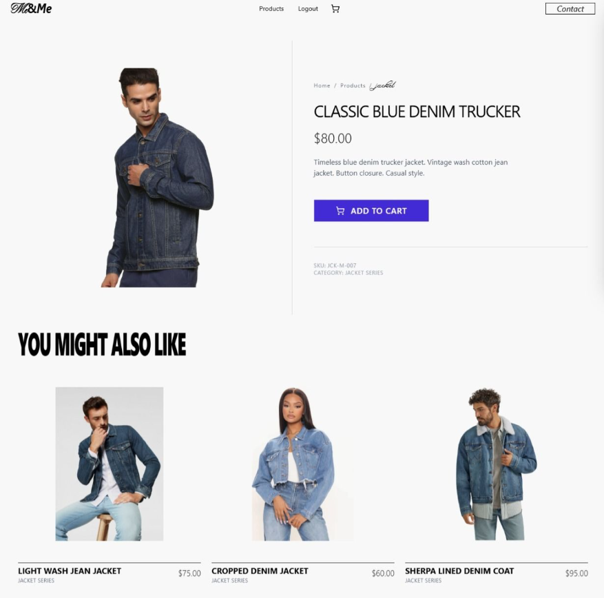
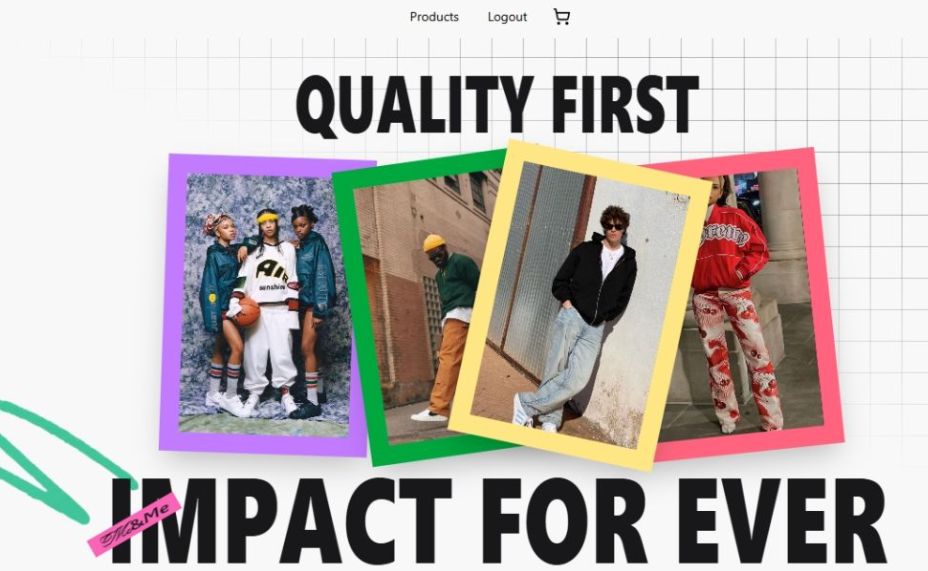
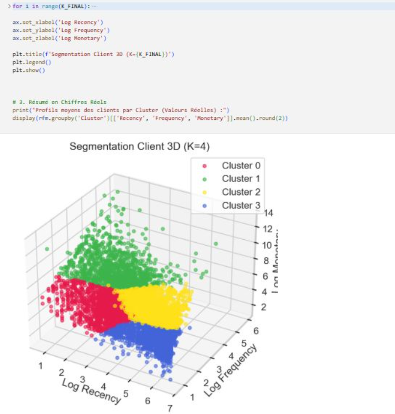

# Me & Me — E-Commerce Platform with Hybrid Recommendation System

**Me & Me** is a full-stack e-commerce project designed to deliver a modern online shopping experience enhanced by an intelligent **hybrid recommendation system**.  
The platform combines a clean fashion-oriented storefront with data-driven product recommendation engines to improve product relevance, user engagement, and personalization.

This project was developed collaboratively with:

- **Khadija Mellak**
- **Mohamed Amine Bounja**
- **Bouthayna Ennerhaima**
- **Ilyass El-Ogri**

---

## Overview

The goal of this project was not only to build an e-commerce website, but also to design the algorithmic core behind smarter product suggestions.

Instead of relying on black-box solutions, we built and explored two complementary recommendation approaches:

1. **Content-Based Recommendation**
2. **Behavioral Customer Segmentation using RFM + K-Means**

This hybrid architecture aims to better match products to users by combining:
- product semantic similarity,
- customer behavioral patterns,
- and future potential for adaptive recommendation strategies.

---

## Project Preview

### Home Page

.png)

### Product Details Page

### Customer Segmentation Visualization

### Repository Snapshot

---

## Key Features

- Modern e-commerce user interface
- Product listing and product detail pages
- Responsive front-end design
- Hybrid recommendation pipeline
- Content-based recommendation using NLP techniques
- Customer segmentation using unsupervised learning
- Scalable architecture for future intelligent personalization
- Clear separation between application layer and recommendation logic

---

## Recommendation System Architecture

### 1. Content-Based Engine

The first recommendation engine focuses on the **intrinsic content of products**.

Its objective is to understand product similarity based on product descriptions rather than relying only on user history.

#### Methodology

- **Text Vectorization with TF-IDF**  
  Product descriptions are converted into numerical vectors using **TF-IDF (Term Frequency–Inverse Document Frequency)**.  
  This helps reduce the weight of common words and emphasize more distinctive product terms.

- **Similarity Computation with Cosine Similarity**  
  Once vectorized, product descriptions are compared using **Cosine Similarity** in a multidimensional feature space.  
  This makes it possible to recommend items with semantically similar descriptions.

#### Benefit

This approach is especially useful when:
- products are newly added,
- explicit ratings are unavailable,
- and recommendations must rely on product metadata.

---

### 2. Behavioral Segmentation Engine

The second recommendation-oriented module profiles customers based on transactional behavior through **RFM analysis** and **K-Means clustering**.

#### RFM Variables

- **Recency**: how recently the customer purchased
- **Frequency**: how often the customer purchased
- **Monetary**: how much the customer spent

#### Data Processing Pipeline

To improve clustering quality, the following preprocessing steps were applied:

- creation of the **RFM matrix**
- handling skewed distributions using **log transformation**
- management of extreme values through **capping at the 99th percentile**
- feature normalization using **StandardScaler**

#### Clustering

To determine the best number of clusters, we used:

- **Elbow Method**
- **Silhouette Score**

This ensured clusters that are both:
- compact,
- and well separated.

The 3D segmentation visualization below illustrates the final clustering outcome:

#### Benefit

This module allows the system to:
- identify customer behavior profiles,
- group similar users,
- and support more personalized recommendation strategies.

---

## Tech Stack

Based on the project materials, code snapshot, and project context, the stack includes:

### Front-End
- **React**
- **HTML**
- **CSS**
- **JavaScript**

### Back-End
- **Node.js**
- **Express**
- **Flask**

### Data / AI / Machine Learning
- **Python**
- **Scikit-learn**
- **TF-IDF**
- **Cosine Similarity**
- **K-Means Clustering**

### Database
- **MySQL**

---

## Repository Structure

From the repository snapshot, the recommendation part currently includes notebooks and supporting data such as:

- `Collaborative Filtering.ipynb`
- `Content-Based Filtering_last version.ipynb`
- `mockData/`
- `README`

This reflects a project architecture where experimentation and recommendation logic were developed alongside the e-commerce application.

---

## Example Functional Flow

1. A user browses products on the e-commerce platform.
2. The system analyzes product content and customer behavioral segments.
3. Relevant products are suggested through recommendation logic.
4. The platform aims to improve user discovery and shopping experience through personalization.

---

## Research and Engineering Focus

This project was also an opportunity to go beyond interface development and work on the **core intelligence layer** of an e-commerce system.

Main technical challenges addressed:

- semantic understanding of product descriptions,
- customer profiling without explicit ratings,
- preprocessing transactional data for clustering,
- balancing interpretability and performance,
- preparing the system for more advanced recommendation strategies.

---

## Next Step — Reinforcement Learning

The current models are effective, but still **static**.

A future extension of this project is to move toward **Reinforcement Learning (RL)**, where recommendation agents can adapt dynamically in real time based on user interactions such as:

- clicks,
- views,
- purchases,
- and engagement patterns.

The objective is to shift from history-based recommendation to an adaptive strategy based on:

- **exploration vs exploitation**
- reward-driven learning
- continuous optimization of recommendation relevance

---

## Conclusion

**Me & Me** is more than a simple e-commerce website.  
It is a practical full-stack project combining web development, machine learning, and recommender system design.

By integrating a modern storefront with a hybrid recommendation architecture, the project demonstrates how AI can enhance product relevance and user experience in digital commerce.

---

## Keywords

`Data Science` `Machine Learning` `KMeans` `NLP` `Python` `ScikitLearn` `Artificial Intelligence` `React` `Full Stack` `NodeJS` `Express` `Flask` `MySQL` `Recommendation System` `E-Commerce`

---

## Author Note

This README presents the project from both the application and recommendation-system perspectives, highlighting the technical work achieved by the team and the AI-oriented direction of the platform.
